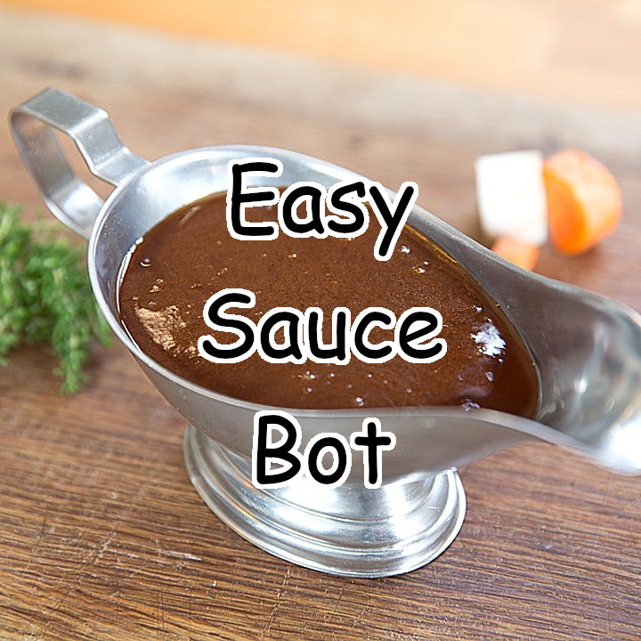
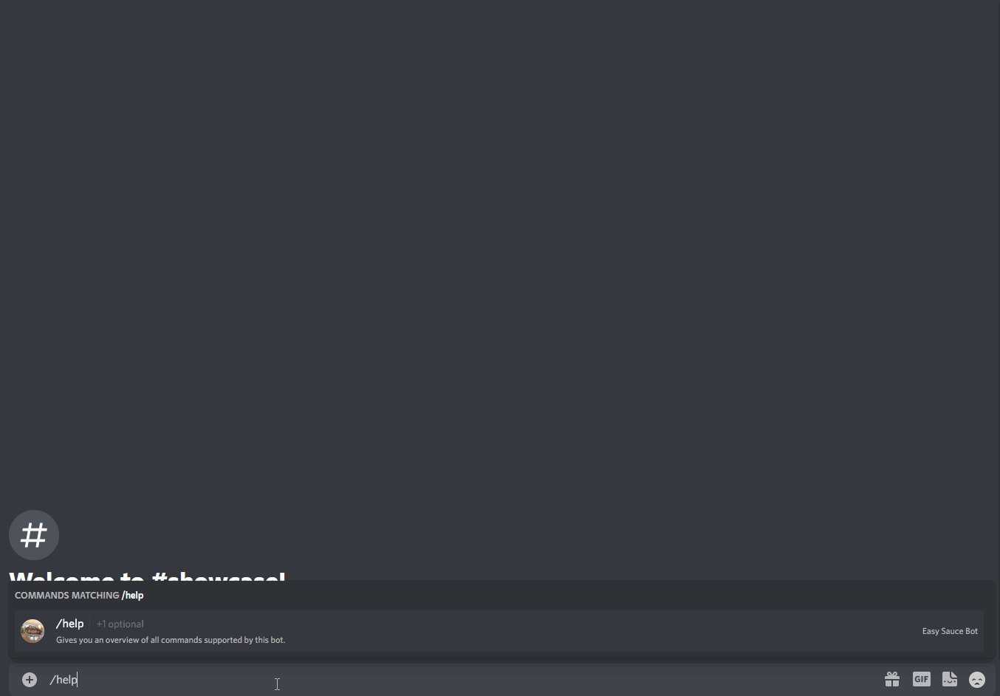
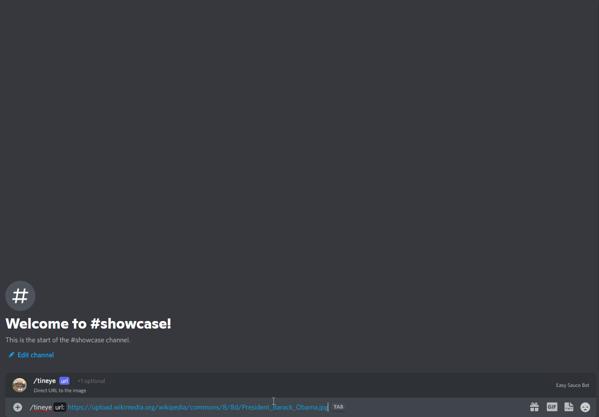
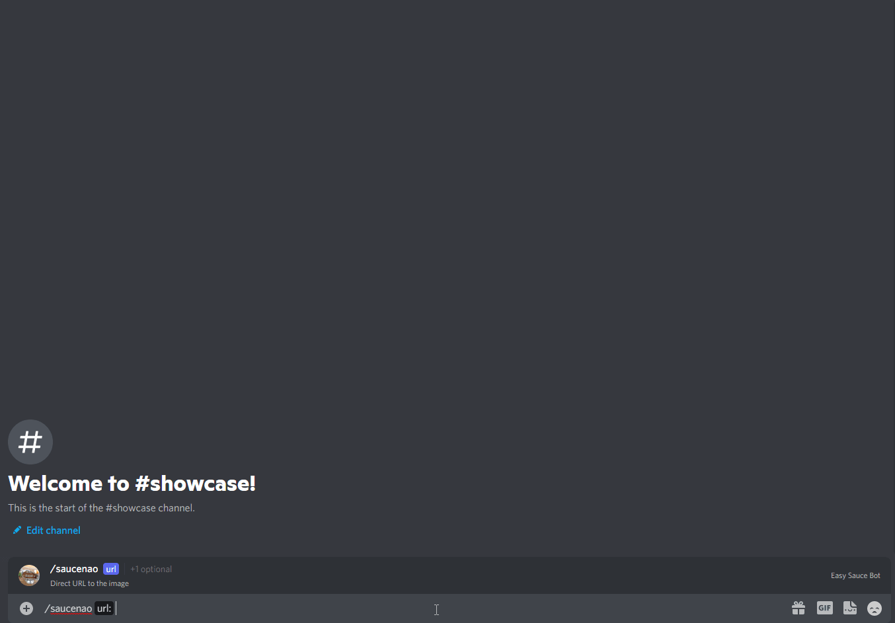
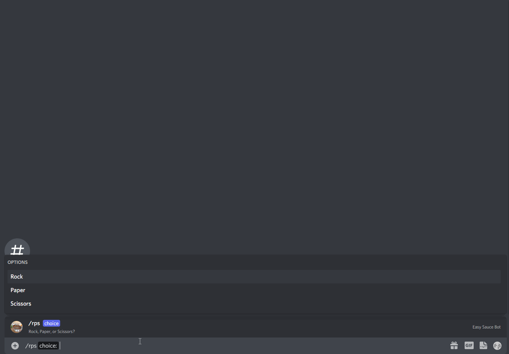
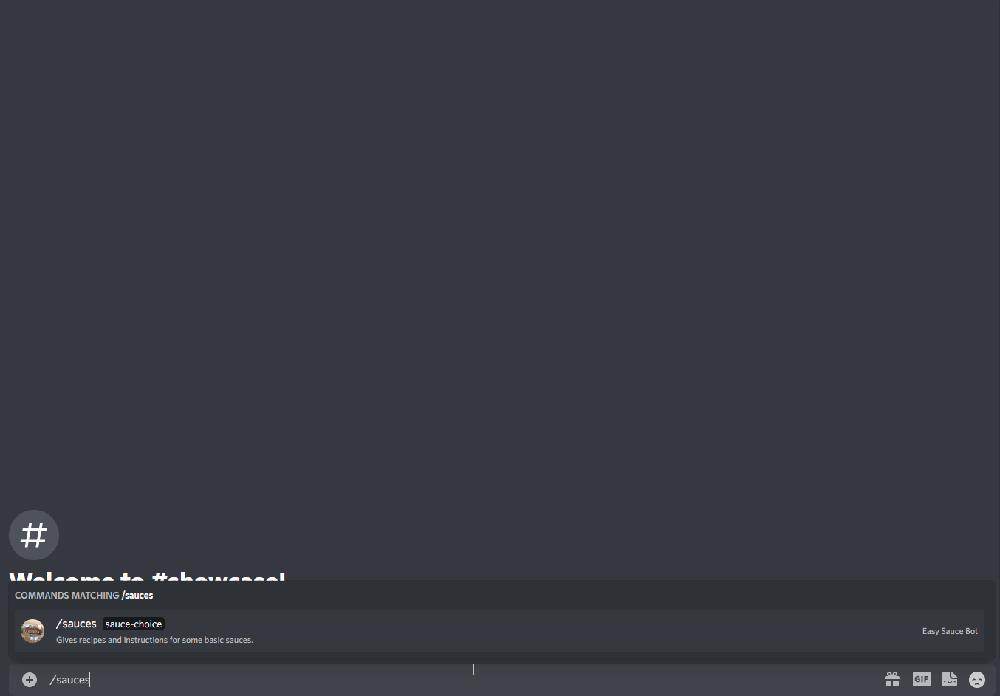

Easy Sauce Bot
==============

<p align="center"></p>

> A simple Discord bot to gather information about the source of images.

---

## 📋 Table of Contents
- [Description](#description)
    - [About](#about)
    - [Technologies](#technologies)
- [Structure](#structure)
    - [API](#api)
    - [Bot](#bot)
- [Setup and Usage](#setup-and-usage)
    - [Installation](#installation)
    - [Usage](#usage)
- [Showcase](#showcase)
    - [Search](#search)
    - [Commands](#commands)
- [References](#references)

---

<h2 id="description">🎯 Description</h2>

### About
This is a Discord bot that tries to get information on the source
of a provided image. It does a basic reverse image search for the user.

The aim of this project was for me to get back into coding with plain
Javascript as well as getting to know `Puppeteer` and `Discord.js`.

This project may or may not be updated in the future if I feel like I
need to add some functions (or an AI just because I want to and it's a cool thing to do).

### Technologies
This project was created using Javascript (CommonJS) only. Additionally these
technologies/libraries were used:

* [Node.js 16.8.0](https://nodejs.org/en/)
* [discord.js 13.1.0](https://discord.js.org/#/)
* [puppeteer 10.4.0](https://github.com/puppeteer/puppeteer)
* [dotenv 10.0.0](https://github.com/motdotla/dotenv)
* [axios 0.21.4](https://github.com/axios/axios)

---

<h2 id="structure">🏗️ Structure</h2>
This project is divided into two parts. `api/` for the reverse image
search logic and `bot/` for the discord bot.

### API
Inside `api/` there is `search.js` which is the main file. It handles
everything related to reverse image searching in this project. Currently
it exposes three functions for external use:

* `searchWithGoogle`: Takes an image url and returns an object with image
text clues from _Google_, the first <= 5 similar images as well as the first
<= 5 pages which contain the image you are looking for. This will also take
a screenshot (stored in `screenshots/`) of the similar images page to let the
viewer see images outside the first 5. All these information are gathered by crawling through the _Google_ search pages using _puppeteer_.
* `searchWithTinEye`: Similar to searchWithGoogle this takes an image url and
returns an object with all matches on the _TinEye_ search for that image as well
as information on those matches like crawl dates, titles, ... This also uses
_puppeteer_ for the search instead of the official API.
* `searchWithSauceNao`: Takes an image url and performs an image search using
the _SauceNao API_. This then returns an object containing the first <= 16 results
of that search. To use this function a valid _SauceNao API key_ has to be provided.

More information on the functions, their returned objects and edge cases can
all be found in their documentation strings. **Everything** is written there.
**Examples** can be found in `api/examples.js`.

Importing `search.js` is enough for this to work. No setup needed.
```javascript
const api = require('/path/to/api/search')
```

### Bot
The `bot/` directory contains all files for the Discord bot. `index.js` is the
main bot file. It starts the client. `deploy_commands.js` is used every time
commands are updated or new commands are added to the bot.

`bot/commands/` is the directory where all commands are located at. Commands are
dynamically loaded by `index.js`. `bot/events/` is a similar directory, but for
all Discord events the bot listens to. These are also dynamically loaded.

---

<h2 id="setup-and-usage">🔧 Setup and Usage</h2>

### Installation
1. download/clone this project
2. `npm i` in console inside this project's directory
3. Provide a `.env` file and place it inside the root directory. The structure of this file should be
    ```
    # API
    SAUCENAO_API_KEY=<your SauceNao API key>
    
    # Discord
    DISCORD_BOT_TOKEN=<your Discord bot token>
    DISCORD_CLIENT_ID=<your Discord bot's client's id>
    DISCORD_GUILD_ID=<your Discord bot's dev server's id>

    # Colors
    COLOR_ERROR=<error indicator color, mine is #e74c3c>
    COLOR_SUCCESS=<error indicator color, mine is #27ae60>
    COLOR_INFORMATION=<error indicator color, mine is #8e44ad>

    # Images
    SAUCENAO_IMAGE=<direct url to the image that you want to use as SauceNao icon>
    TINEYE_IMAGE=<direct url to the image that you want to use as TinEye icon>
    GOOGLE_IMAGE=<direct url to the image that you want to use as Google icon>
    ```

### Usage
For the commands to work, you need to deploy all slash commands of this bot. _development server_ is the Discord server with id = _DISCORD_GUILD_ID_.

* **Deploying new/modified (in options or names) commands on development server**:
    ```
    npm run deploy
    ```
* **Deploying new/modified (in options or names) commands globally**:
    ```
    npm run deploy-global
    ```
* **Starting the bot**:
    ```
    npm run start
    ```

After deployment and starting the bot should respond to all slash commands in Discord's chats and threads.

---

<h2 id="showcase">👀 Showcase</h2>

### Search
The following examples just show basic usage of the functions. For more information
on the returned objects and optional parameters see `api/examples.js`.

#### Google Search
```Javascript
// Success:
const successResult = await api.searchWithGoogle(
    'https://upload.wikimedia.org/wikipedia/commons/8/8d/President_Barack_Obama.jpg')

// Error:
const errorResult = await api.searchWithGoogle('nonsense.url')
```

#### TinEye Search
```Javascript
// Success:
const successResult = await api.searchWithTinEye(
    'https://upload.wikimedia.org/wikipedia/commons/8/8d/President_Barack_Obama.jpg')

// 0 Matches:
const zeroResult = await api.searchWithTinEye('https://i.redd.it/jt3msod1i9s71.jpg')

// Error:
const errorResult = await api.searchWithTinEye('nonsense.url')
```

#### SauceNao Search
```Javascript
// Success:
const successResult = await api.searchWithSauceNao('https://upload.wikimedia.org/wikipedia/en/9/90/One_Piece%2C_Volume_61_Cover_%28Japanese%29.jpg', 2)

// Error:
const errorResult = await api.searchWithSauceNao('nonsense.url')
```

### Commands

#### Help Command `/help`

<br>

#### Google Search Command `/google`

<br>

#### TinEye Search Command `/tineye`

<br>

#### Saucenao Search Command `/saucenao`

<br>

#### Rock Paper Scissors Command `/rps`

<br>

#### Sauce Recipes Command `/sauces`

<br>

---

<h2 id="references">📙 References</h2>
These are some helpful resources or tips to learn more about the technologies used in this project:

- [Discord.js Guide](https://discordjs.guide/)
- [Discord.js Documentation](https://discord.js.org/#/docs/main/stable/general/welcome)
- [Discord Dev Portal](https://discord.com/developers/docs/intro)
- [Puppeteer Showcase by Google](https://developers.google.com/web/tools/puppeteer)
- [Puppeteer Documentation](https://pptr.dev/)
- [Asynchronous Javascript](https://developer.mozilla.org/en-US/docs/Learn/JavaScript/Asynchronous)
- A lot of trial and error to find the search page' relevant XPaths and classes or ids for HTML elements.